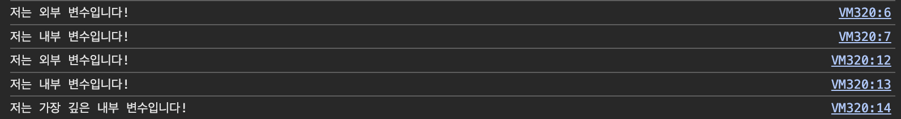

**[목차]**
- [스코프(범위; Scope)](#스코프범위-scope)
- [렉시컬 스코프(Lexical scope)](#렉시컬-스코프lexical-scope)
- [호이스팅(Hosting)](#호이스팅hosting)
  - [참고](#참고)
- [TDZ(Temporal Dead Zone)](#tdztemporal-dead-zone)
- [클로저(Closure)](#클로저closure)
  - [참고](#참고-1)

<br>

## 스코프(범위; Scope)

- 변수 스코프(범위; Scope)를 설정하는 것은 함수 또는 블록 단위로 이루어지며, 이는 모든 언어에서 가장 기본적인 특징 중 하나입니다. 이 특징은 아마도 프로그램이 어떻게 동작하는지에 가장 큰 영향을 미칩니다.

- 스코프(범위; Scope)를 양동이라고 비유하면, 변수는 그 양동이에 넣는 구슬과 같습니다. 언어의 스코프 모델은 어떤 색상의 구슬이 어떤 동일한 색상의 양동이에 들어갈지를 결정하는 규칙과 같습니다.

- 스코프는 서로 중첩될 수 있으며, 특정 표현식(expression)이나 문장(statement)에 대해 해당 스코프 또는 그 이상의 외부 스코프에서만 변수에 접근할 수 있습니다. 반면, 더 낮은 또는 내부 범위의 변수는 숨겨져 있어 접근할 수 없습니다.

    **[예제]**

    ```jsx
    let outerVar = "저는 외부 변수입니다!"; // 외부 범위에서 정의됨

    function outerFunction() {
        let innerVar = "저는 내부 변수입니다!"; // 내부 범위에서 정의됨

        console.log(outerVar); // 외부 범위에 있기 때문에 접근 가능
        console.log(innerVar); // 같은 범위에 있기 때문에 접근 가능

        function innerFunction() {
            let innermostVar = "저는 가장 깊은 내부 변수입니다!"; // 가장 깊은 내부 범위에서 정의됨

            console.log(outerVar); // 외부 범위에 있기 때문에 접근 가능
            console.log(innerVar); // 외부 범위에 있기 때문에 접근 가능
            console.log(innermostVar); // 같은 범위에 있기 때문에 접근 가능
        }

        innerFunction();

        // console.log(innermostVar); // 이 범위에서는 innermostVar에 접근할 수 없으므로 오류가 발생함
    }

    outerFunction();

    ```

    > 이 코드에서, `outerVar`는 가장 외부 범위에서 정의되었으므로 어디에서든 접근 가능합니다. `innerVar`는 `outerFunction`과 `innerFunction`에서만 접근 가능하며, 이는 `innerFunction`에 비해 외부 범위에 정의되었기 때문입니다. `innermostVar`는 가장 내부 범위에서 정의되었으므로 `innerFunction`에서만 접근 가능합니다.

    <div align="center">
        
    </div>

<br>

## 렉시컬 스코프(Lexical scope)

- 렉시컬 스코프는 대부분의 언어에서 범위가 어떻게 작동하는지를 나타냅니다. 스코프의 경계와 변수 구성은 프로그램이 파싱(컴파일)되는 시점에 결정됩니다. 이는 작성 시점에서 결정되는 사항입니다. 프로그램에서 함수나 범위의 위치에 따라 해당 프로그램 일부의 범위 구조가 결정됩니다.

    **[예제]**

    ```jsx
    let name = "전역 변수";  // 전역 변수

    function outerFunction() {
        let name = "outerFunction 스코프의 지역 변수";  // outerFunction 스코프의 지역 변수

        function innerFunction() {
            console.log(name);  // outerFunction 스코프의 'name'에 접근
        }

        innerFunction();  // 출력: "outerFunction 스코프의 지역 변수"
    }

    outerFunction();

    console.log(name);  // 출력: "전역 변수" - 전역 변수에 접근
    ```

    > 스코프의 경계와 변수 구성은 프로그램이 파싱(컴파일)되는 시점에 결정되며, 따라서 작성 시점에서 결정됩니다. 코드에서 `name`이라는 변수는 두 번 선언되었지만, 각 변수는 서로 다른 스코프에 있습니다. `name` 변수는 전역 스코프와 `outerFunction`의 함수 스코프에 각각 선언되었습니다. `innerFunction`은 `outerFunction`의 스코프에 접근할 수 있으므로 `outerFunction` 스코프의 `name` 변수를 출력합니다. 반면, `outerFunction`을 호출한 후의 `console.log(name);`는 전역 스코프의 `name` 변수를 참조하므로 "전역 변수"를 출력합니다.

- JS is lexically scoped, though many claim it isn't, because of two particular characteristics of its model that are not present in other lexically scoped languages.

<br>

## 호이스팅(Hosting)

- 호이스팅은 자바스크립트에서 변수나 함수를 선언하기 전에도 사용할 수 있게 하는 중요한 특성입니다. 이는 선언된 변수와 함수가 자동으로 해당 범위의 맨 위로 이동되기 때문입니다. 이 특성 덕분에 변수나 함수를 선언하기 전에 미리 참조하거나 호출할 수 있습니다. 그러나 변수는 선언되기 전에 `undefined` 상태이므로, 선언 없이 사용하면 예상치 못한 결과를 초래할 수 있습니다. 반면에 함수의 경우, 호이스팅이 발생하면 함수의 전체 본문이 함께 이동하므로 선언 전에도 호출할 수 있습니다.

    **[예제: 변수]**
    
    ```jsx
    console.log(myVar); // 출력: undefined

    myVar = 5; // myVar에 5를 할당

    console.log(myVar); // 출력: 5

    var myVar; // myVar 선언
    ```

    > 이 코드에서 변수 `myVar`는 스코프의 상단으로 호이스팅됩니다. 이는 변수가 선언되기 전에도 사용이 가능하다는 것을 의미합니다. 하지만 이 변수는 명시적으로 값이 할당되는 부분까지 `undefined` 상태로 유지됩니다. 때문에, 변수 `myVar`는 선언되지 않았음에도 불구하고 코드 상의 위치에 관계없이 사용이 가능하며, 실제 값이 할당되기 전까지는 `undefined`라는 값을 가지게 됩니다.

    **[예제: 함수]**

    ```jsx
    // 함수 선언 전에 함수 호출
    greet();

    // 함수 선언
    function greet() {
        console.log("Hello, World!");
    }
    ```

    > 이 코드에서, `greet()` 함수는 선언되기 전에 호출되었습니다. 그러나 자바스크립트의 함수 호이스팅 때문에 함수 선언이 스코프의 상단으로 이동하여, 선언 전에도 호출할 수 있게 됩니다.

-  `var`로 선언된 변수는 선언된 함수 내에서 어디에서나 접근할 수 있습니다.

    **[예제]**

    ```jsx
    function exampleFunction() {
        var varVariable = '함수 내부에 있습니다';
    
        if (true) {
            var varVariable = 'if 문 내부에 있습니다';
            console.log(varVariable); // 출력: 'if 문 내부에 있습니다'
        }
    
        console.log(varVariable); // 출력: 'if 문 내부에 있습니다'
    }
    
    exampleFunction();
    
    ```
    
    > 이 예시에서 `varVariable`은 먼저 함수 내부에서 선언되었고 그 다음 `if`문 내부에서 선언되었습니다. 그러나 `if`문 내부에서의 두번째 선언이 `var`가 함수 범위를 가지기 때문에 전체 함수 범위에 있는 변수에 영향을 줍니다. 따라서 두번째 `console.log(varVariable)` 역시 'if 문 내부에 있습니다'를 출력합니다.

- JavaScript의 렉시컬 스코프(Lexcial Scope)를 무효화하는 논리가 호이스팅과 `var`의 함수 범위에만 의존하는 것은 부족합니다. JavaScript는 코드 위치에 따라 변수 범위를 결정하는  렉시컬 스코프를 기반으로 합니다. `var`의 함수 범위와 호이스팅은 JavaScript의 특성이지만,  렉시컬 스코프 원칙을 근본적으로 훼손하지 않습니다.

    **[예제]**

    ```jsx
    console.log(myVar); // 호이스팅 때문에 출력: undefined
    
    function exampleFunction() {
        console.log(myVar); // 출력: undefined, `var`가 함수 범위를 가지기 때문
        var myVar = "함수 내부";
        console.log(myVar); // 출력: 함수 내부
    }
    
    var myVar = "함수 외부"; // `var`는 범위의 맨 위로 호이스팅됩니다
    console.log(myVar); // 출력: 함수 외부
    
    exampleFunction();
    console.log(myVar); // 출력: 함수 외부, 렉시컬 스코프 지정 때문
    
    ```
    
    > 이 예시에서 `myVar`는 두 번 선언되었습니다. 한 번은 `exampleFunction` 외부에서, 다른 한 번은 내부에서 선언되었습니다. 두 선언에도 불구하고 렉시컬 스코프 지정 덕분에 `myVar`의 두 인스턴스는 각각의 범위를 유지합니다 - `exampleFunction` 외부의 `myVar`는 `exampleFunction` 내부의 `myVar`에 영향을 주지 않습니다.
    
    > `var` 키워드는 블록 범위가 아닌 함수 범위를 가지는 변수를 생성합니다. 이는 `myVar`가 `exampleFunction` 내의 어디에서나 사용 가능하다는 것을 의미하며, 이는 호이스팅 때문에 선언 행 이전에도 사용 가능합니다.
    
    > 이러한 `var`와 호이스팅의 행동에도 불구하고 렉시컬 스코프 지정의 기본 원칙은 위반되지 않습니다: "변수의 범위는 코드 내에서 어디에 선언되었는지에 따라 결정됩니다."


### 참고

- [Stack overflow: Lexical scope and Hoisting in javascript](https://stackoverflow.com/questions/47163068/lexical-scope-and-hoisting-in-javascript)
- [Stack overflow: Javascript function scoping and hoisting](https://stackoverflow.com/questions/7506844/javascript-function-scoping-and-hoisting)
- [FreeCodeCamp: Lexical Scope in JavaScript](https://www.freecodecamp.org/news/lexical-scope-in-javascript/#:~:text=The%20process%20of%20determining%20the,two%20things%3A%20parsing%20and%20execution%20.)

<br>

## TDZ(Temporal Dead Zone)

- `let` 또는 `const`로 선언된 변수의 "Temporal Dead Zone"(TDZ)라는 개념은 변수가 선언된 렉시컬 스코프(Lexical Scope)를 무효화하는 것이 아니라, 독특하게 동작하는 방식을 설명하는 것입니다. 이 TDZ라는 개념은 변수가 선언된 위치와 그 변수가 실제로 초기화되어 사용 가능하게 되는 위치 사이의 구간을 나타냅니다. 이 구간에서 변수에 접근하려고 시도하면 JavaScript 엔진은 오류를 던집니다.

    **[예제]**

    ```jsx
    console.log(myLetVar); // ReferenceError: 초기화하기 전에 'myLetVar'에 접근할 수 없습니다.
    let myLetVar = 5; // myLetVar는 이 행이 실행될 때까지 TDZ에 있습니다.
    console.log(myLetVar); // 이제 초기화되어 사용할 수 있습니다. 출력: 5

    ```

    > 위 코드에서 `myLetVar` 변수는 스코프 시작부터 정의된 행까지 TDZ에 있습니다. 초기화 전에 접근하려고 하면 ReferenceError가 발생합니다.


<br>

## 클로저(Closure)

- 클로저는 함수가 일급 값(first-class values)인 언어에서 어휘 범위의 결과로, 함수가 외부 변수를 참조하고 다른 범위에서 실행될 때, 원래 변수에 대한 접근을 유지합니다.

    ```
    자바스크립트에서 일급 값(first-class values)은 변수에 할당될 수 있고, 배열에 포함될 수 있으며, 함수의 인수로 전달될 수 있거나, 함수에서 반환될 수 있는 엔티티를 말합니다. 그들은 다른 값처럼 취급됩니다. 
    ```

    **[예제]**

    ```jsx
    function outerFunction(outerVariable) {
        return function innerFunction(innerVariable){
            console.log('outerVariable:', outerVariable);
            console.log('innerVariable:', innerVariable);
        }
    }

    const newFunction = outerFunction('outside');
    newFunction('inside'); // 로그 출력: outerVariable: outside, innerVariable: inside

    ```

    > 이 예시에서, `outerFunction`은 하나의 인자 `outerVariable`을 받는 함수이며, `innerFunction`을 반환합니다.
    > `innerFunction`은 또한 하나의 인자 `innerVariable`을 받는 함수이며, `outerVariable`과 `innerVariable`을 로그로 출력합니다.

    > 여기서 중요한 부분은: `outerFunction('outside')`을 호출할 때, 이는 `innerFunction`을 반환하고 이를 `newFunction`에 할당합니다.
    > 그런 다음 `newFunction('inside')`를 호출하면, 'outside'와 'inside' 둘 다 출력합니다.

    > `outerFunction`의 실행이 끝나고 그 범위가 사라졌음에도 불구하고, `newFunction`은 여전히 `outerVariable`에 접근할 수 있습니다. 이는 `innerFunction`이 자신의 범위( `innerVariable`와 함께)를 포함하는 클로저이며, 외부 범위(`outerVariable`와 함께)에 대한 접근을 유지하기 때문입니다.로, 함수가 외부 변수를 참조하고 다른 범위에서 실행될 때, 원래 변수에 대한 접근을 유지합니다.


### 참고

- [MDN: Closures](https://developer.mozilla.org/en-US/docs/Web/JavaScript/Closures)