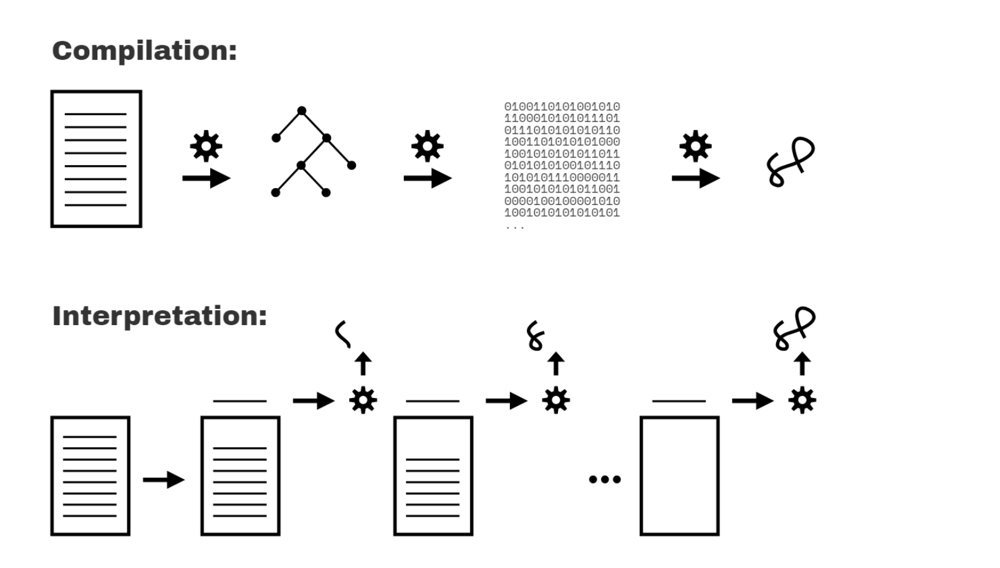

# 1. 스코프

<br>

- [1. 스코프](#1-스코프)
  - [1.1 책에 대하여](#11-책에-대하여)
    - [JS 실행과정](#js-실행과정)
  - [1.2 컴파일 vs 인터프리트](#12-컴파일-vs-인터프리트)
  - [1.3 코드 컴파일](#13-코드-컴파일)
    - [구문오류](#구문오류)
    - [초기오류](#초기오류)
    - [호이스팅](#호이스팅)
  - [1.4 컴파일러체](#14-컴파일러체)
  - [1.5 런타임에 스코프 변경하기](#15-런타임에-스코프-변경하기)
  - [1.6 렉시컬 스코프](#16-렉시컬-스코프)

<br>

## 1.1 책에 대하여

프로그래밍 언어를 컴파일 언어와 인터프리터를 거치는 스크립트 언어로 구분하면, JS는 일반적으로 스크립트 언어로 분류됩니다. 따라서 JS로 작성한 프로그램 대부분은 위에서 아래로 한줄씩 처리된다고 가정

그런데 실제로 JS는 실행 전 별도의 단계에서 파싱,컴파일이 일어납니다.
개발자가 지정한 변수와 함수, 블록의 위치는 파싱, 컴파일 단계에서 스코프 규칙에 따라 분석되고, 그 결과에 따라 결정된 스코프 구조는 대개 런타임 조건에 영향을 받지 않습니다.

JS에서 함수는 일급값이기 때문에 숫자나 문자열처럼 변수에 할당할 수 있고, 다른 곳으로 넘기는 것도 가능합니다. 그런데 다른 곳으로 넘긴 함수 내에서 외부 변수를 사용하는 경우, 해당 변수는 어딘가에 접근해야 하므로 JS는 함수를 프로그램 내 어디에서 실행했는지와는 상관없이 정의할 때 결정된 스코프를 유지합니다. 이를 클로저라고 합니다.
<br>

### JS 실행과정

> 파싱 -> 컴파일 -> 실행 -> 최적화

1. 파싱(Parsing)
   소스 코드 읽기: JavaScript 엔진은 소스 코드를 문자열로 읽어들입니다.
   구문 분석: 소스 코드를 구문 트리(Abstract Syntax Tree, AST)로 변환합니다.
   이 과정에서 코드가 문법적으로 올바른지 확인합니다.
   구문 오류가 있으면 코드 실행이 중단됩니다.

2. 컴파일(Compilation)
   바이트코드 생성: AST를 바이트코드라는 중간 표현으로 변환합니다.
   바이트코드는 인터프리터가 실행할 수 있는 코드입니다.
   일부 엔진은 여기서 JIT(Just-In-Time) 컴파일을 통해 초기 실행 시 최적화를 수행합니다.

3. 실행(Execution)
   인터프리테이션: 바이트코드를 인터프리터가 실행합니다.
   인터프리터는 바이트코드를 한 줄씩 읽고 실행합니다.
   프로파일링: 코드가 실행되는 동안 성능 데이터를 수집합니다.
   어떤 함수나 코드 블록이 자주 실행되는지, 시간이 많이 소요되는지 등의 정보를 수집합니다.

4. 최적화(Optimization)
   JIT 컴파일: 프로파일링 데이터를 바탕으로 자주 실행되는 코드 경로를 최적화합니다.
   자주 실행되는 함수나 루프를 기계어로 컴파일하여 성능을 향상시킵니다.
   최적화된 기계어 코드를 실행하여 성능을 극대화합니다.
   Deoptimization: 예상과 다른 실행 패턴이 발견되면, 최적화를 되돌리고 인터프리터로 다시 실행합니다.
   동적 언어 특성상 최적화된 코드가 항상 최적의 성능을 보이지 않을 수 있습니다.

전체 실행 흐름
소스 코드 → AST
AST → 바이트코드 (초기 컴파일)
바이트코드 실행 (인터프리터)
프로파일링 데이터 수집
바이트코드 → 기계어 (JIT 컴파일러에 의한 최적화)
기계어 실행

## 1.2 컴파일 vs 인터프리트

**컴파일레이션**은 텍스트 형식으로 작성한 코드를 처리해서 컴퓨터가 이해할 수 있는 작업 지시 목록으로 바꾸는 일련의 과정입니다. 이 과정을 거치면 보통 한번에 소스 코드가 변환되는데, 변환 결과는 추후에 실행가능한 형태로 저장됩니다.

**인터프리테이션**은 개발자가 작성한 프로그램을 기계가 해석할 수 있는 명령으로 변환한다는 점에서 컴파일과 유사합니다. 하지만 처리방식이 다릅니다.

컴파일레이션은 프로그램을 한 번에 처리<br>
인터프리테이션은 소스 코드를 한 줄씩 변환한다는데 차이가 있습니다.


실제로 JS엔진은 프로그램을 처리할때 수 많은 종류의 컴파일레이션과 인터프리테이션을 사용합니다.
<br>

## 1.3 코드 컴파일

스코프는 주로 컴파일 중에 결정됩니다.

고전 컴파일러 이론에서 컴파일러 단계

1. 1단계 토크나이징/렉싱 : 문자열을 토큰이라는 불리는 의미 있는 조각으로 쪼갭니다.

var a = 2 코드가 있다고 가정, 1단계를 거치면 var,a,2,;로 조각납니다.
토크 나이징과 렉싱엔 미묘하고 학술적인 차이가 있는데, 둘의 차이는 토큰을 무상태방식으로 인식하는지와 상태 유지방식으로 인식하지는에 있습니다. 쉽게 설명하자면 토크나이저가 a를 별개의 토큰으로 분리할지 아니면 다른 토큰의 일부로 처리할지 결정할 때 상태 유지 파싱 규칙을 적용한다면 이는 렉싱입니다.

2. 2단계 파싱: 토큰 배열을 프로그램 문법 구조를 반영하는 중접 원소 기반 트리인 AST로 바꿉니다.

코드 var a = 2; 는 파싱을 거치면 변수 선언 이라 불리는 최상위 노드와 a의 값을 가지는 식별자 노드, 할당식 이라 불리는 노드를 자식 노드로 가진 트리가 됩니다.

3. 3단계 코드생성: AST를 컴퓨터가 실행 가능한 코드로 변환합니다.

JS엔진은 var a = 2; 라는 코드를 AST로 바구고 AST를 컴퓨터가 실행 가능한 코드로 바꾸는데, 이과정에서 실제 a라는 변수가 생성되고, 그 후 변수 a에 2가 저장되는 것

JS 엔진은 앞서 설명한 세 단계로 설명한 것보다 훨씬 복잡하게 돌아감.
파싱과 코드 생성 단계에서 실행 최적화를 위해 몇 가지 추가 작업이 진행됩니다.

다른 언어와 달리 JS 컴파일레이션은 구축 단계에서 일어나는 게 아니기 때문에 JS엔진은 충분한 시간을 확보하지 못한 채 맡은 임무나 최적화를 수행

JavaScript는 실행 중에 최적화를 수행하는 반면, 많은 다른 언어들은 프로그램 실행 전에 최적화를 수행합니다. 이를 통해 각 접근 방식의 장단점을 이해할 수 있습니다.

JavaScript의 실행 중 최적화
JavaScript 엔진(V8, SpiderMonkey 등)은 Just-In-Time (JIT) 컴파일러를 사용하여 실행 중에 최적화를 수행합니다. 이 방식의 특징은 다음과 같습니다:

동적 타이핑:

JavaScript는 동적 타이핑을 지원하므로 변수의 타입이 실행 시간에 결정됩니다.
JIT 컴파일러는 실행 중에 타입 정보를 수집하여 최적화를 수행할 수 있습니다.
프로파일링 기반 최적화:

코드를 실행하면서 성능 프로파일링 데이터를 수집합니다.
자주 실행되는 코드 경로를 식별하고, 해당 경로를 기계어로 컴파일하여 최적화합니다.
실행 중 코드의 실행 패턴이 변경되면, 최적화를 되돌리고 인터프리터로 다시 실행할 수 있습니다 (Deoptimization).
즉시 실행 및 최적화:

초기 실행 시 인터프리터가 바이트코드를 빠르게 실행합니다.
반복적으로 실행되는 코드에 대해서는 JIT 컴파일러가 기계어로 변환하여 성능을 최적화합니다.
다른 언어들의 사전 최적화
C/C++, Java 등의 언어들은 프로그램 실행 전에 최적화를 수행합니다. 이 방식의 특징은 다음과 같습니다:

C/C++
정적 타이핑:

C/C++은 정적 타이핑을 사용하여 변수의 타입이 컴파일 시점에 결정됩니다.
컴파일러는 이 타입 정보를 바탕으로 최적화를 수행합니다.
사전 컴파일 및 최적화:

소스 코드를 기계어로 컴파일하는 과정에서 다양한 최적화 기법을 적용합니다.
예: 인라인 함수, 루프 언롤링, 상수 전파, 코드 제거 등.
실행 파일 생성:

최적화된 기계어 코드를 포함하는 실행 파일을 생성합니다.
실행 파일은 최적화가 적용된 상태로 배포됩니다.
Java
정적 타이핑:

Java도 정적 타이핑을 사용하므로 변수의 타입이 컴파일 시점에 결정됩니다.
바이트코드 컴파일:

Java 컴파일러는 소스 코드를 바이트코드로 컴파일합니다.
바이트코드는 JVM에서 실행됩니다.
JIT 컴파일:

JVM은 바이트코드를 실행하면서 JIT 컴파일을 사용하여 기계어로 변환합니다.
Java의 JIT 컴파일러는 JavaScript와 유사하게 실행 중에 최적화를 수행합니다.
요약
JavaScript:

동적 타이핑: 타입이 실행 시간에 결정됩니다.
JIT 컴파일: 실행 중에 프로파일링 데이터를 수집하고, 자주 실행되는 코드를 최적화합니다.
실행 중 최적화: 즉시 실행 후, 반복되는 코드 경로를 기계어로 변환하여 최적화합니다.
C/C++:

정적 타이핑: 타입이 컴파일 시점에 결정됩니다.
사전 컴파일 및 최적화: 다양한 최적화 기법을 적용하여 실행 파일을 생성합니다.
최적화된 실행 파일: 최적화가 적용된 상태로 배포 및 실행됩니다.
Java:

정적 타이핑: 타입이 컴파일 시점에 결정됩니다.
바이트코드 컴파일: 소스 코드를 바이트코드로 컴파일합니다.
JIT 컴파일: JVM이 바이트코드를 실행하면서 JIT 컴파일을 통해 실행 중에 최적화를 수행합니다.
JavaScript와 Java의 JIT 컴파일은 실행 중 최적화를 수행하여 성능을 높이는 반면, C/C++은 사전 컴파일 시점에 최적화를 수행하여 최적화된 실행 파일을 생성합니다. 각 접근 방식은 언어의 특성과 용도에 따라 최적화 전략을 다르게 적용합니다.

프로그램 처리는 파싱과 컴파일이라는 두 단계이라는 사실

파싱과 컴파일이 후속 절차인 실행 단계와 구분된다는 점은 개발자가 직접 관찰할 수 있는 사실입니다.
**선 컴파일 후 실행**접근 방식을 취하지 않으면 명세서에서 요구하는 동작을 충족할 수 없습니다.

선 컨파일 후 실행 접근 방식을 입증할 수 있는 JS만의 세가지 특징으로는 구문,오류,초기 오류, 호이스팅이 있습니다.

#### 구문오류

```
var greeting = "안녕";

console.log(greeting);

greeting = ."안녕";
// SyntaxError: unexpected token .
```

JS 엔진 입장에서 세 번째 줄에 구문 오류가 있다는 사실을 알 수 있는 유일한 방법은 첫째 줄과 둘째 줄을 실행하기전, 즉 프로그램을 실행하기 전에 전체 프로그램을 먼저 파싱하는 방법 뿐입니다.

#### 초기오류

```
console.log("잘 지내시죠?");

saySomething("안녕하세요","안녕");
// Uncaught SyntaxError: Duplicate parameter name not
// allowed in this context

function saySomething(greeting,greeting) {
    "use strict";
    console.log(greeting);
}
```

엄격 모드에서는 이름이 같은 함수 매개변수가 허용되지 않습니다.(비 엄격 모드에서는 이 규칙이 적용되지 않음)

#### 호이스팅

```
function saySomething() {
    var greeting = "안녕하세요";
    {
        greeting = "잘 지내시죠";  // 여기서 오류
        let greeting = "Hi";
        console.log(greeting);
    }
}

saySomething();
// ReferenceError: Cannot access 'greeting' before
// initialization
```

ReferenceError는 greeting = "잘 지내시죠" 가 있는 줄에서 발생
여기서 변수 greeting은 var greeting = "안녕하세요." 가 아닌 그다음 줄인 let greeting = "안녕!"에서 선언이 이뤄집니다.

<br>

## 1.4 컴파일러체

JS 프로그램은 컴파일 후 실행에 걸쳐 처리된다는 지식을 바탕으로 이번에는 JS엔진이 어떻게 변수를 식별하는지와 컴파일 후 프로그램의 스코프를 결정하는 지 알아봅시다.
<br>

## 1.5 런타임에 스코프 변경하기

스코프는 프로그램이 컴파일될 때 결정되고, 런타임 환경에는 영향을 받지 않는 다는게 명확해졌을 겁니다.
그런데 비엄격 모드에서는 런타임에도 프로그램의 스코프를 수정할 수 있는 방법 두 가지가 있어서 이 방법을 사용하면 규칙을 깰 수 있습니다.

하지만 두 방법 모두 사용해서는 안됩니다. 위험하고 개발자를 혼란스럽게 함

첫 번째 방법 eval()함수
컴파일과 실행의 대상이 되는 문자열 형태의 소스 코드를 받는데 이 소스 코드는 런타임에 컴파일 실행됩니다.

```
function badIdea() {
    eval("var oops = 'Ugh!';");
    console.log(oops);
}
badIdea();   // Ugh!
```

eval를 쓰지 말아야 하는 이유는 아주 많으나 대표적인 이유는 성능때문인데, badIdea가 실행될 때마다 컴파일과 최적화가 이미 끝난 스코프 다시 수정 하기 때문에 CPU자원을 쓸 수 밖에 없습니다.

두 번째 방법 with
with는 특정 객체의 스코프를 지역스코프로 동적으로 변환합니다. 이렇게 스코프가 변환되면 새로운 지역 스코프에서는 객체의 프로퍼티가 식별자가 되기 때문에 객체를 통하지 않고 바로 사용 가능

```
var badIdea = { oops: "Ugh!" };

with (badIdea) {
    console.log(oops);   // Ugh!
}
```

with를 사용하는 것 역시 성능과 가독성 측면에서 끔찍한 생각이니 가능하면 사용 하지 않는게 좋습니다.

<br>

## 1.6 렉시컬 스코프

지금까지 스코프가 컴파일 타임에 결정된다는 사실을 증명했습니다. 이렇게 컴파일 타임에 결정되는 스코프를 렉시컬 스코프(어휘 스코프)라고 합니다. 렉시컬 스코프에서 렉시컬은 앞서 우리가 배운 컴파일레이션 세 단계 중 렉싱과 관련이 있습니다.

이번 장에서 설명하는 렉시컬 스코프의 핵심은 함수나 블록, 변수 선언의 스코프는 전적으로 코드 배치에 따라 제한된다는 점

컴파일레이션은 스코프와 변수의 메모리 예약 관점에서 실제로는 아무것도 하지 않는 다는게 중요합니다.
컴파일레이션 중에는 그 어떤 프로그램도 실행되지 않으니까요.

대신 컴파일 도중에는 프로그램 실행에 필요한 모든 렉시컬 스코프가 들어간 지도가 만들어집니다.
런타임에 사용할 모든 코드가 들어간 계획안이 이때 만들어진다고 생각하면 됩니다.
여기에는 렉시컬 환경이라고 칭해지는 스코프가 전부 정의되고 각 스코프에 해당하는 식별자(변수)가 추가됩니다.

즉, 스코프는 컴파일 동안 식별되지만, 런타임까지 실제로 생성되지 않으며, 각 스코프가 실행되어야 할 때마다 생성됩니다. 다음 장에서는 렉시컬 스코프의 개념적 기초를 스케치해 보겠습니다.

<br>
